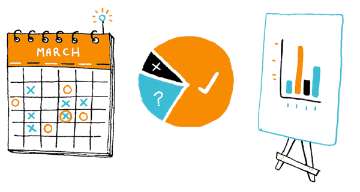
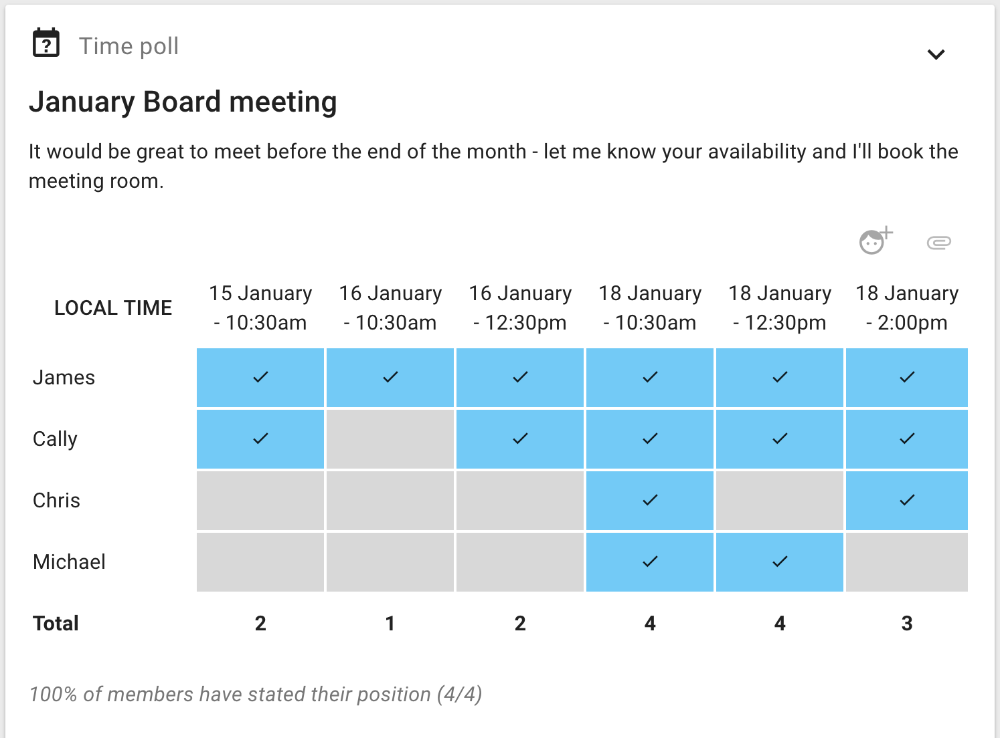
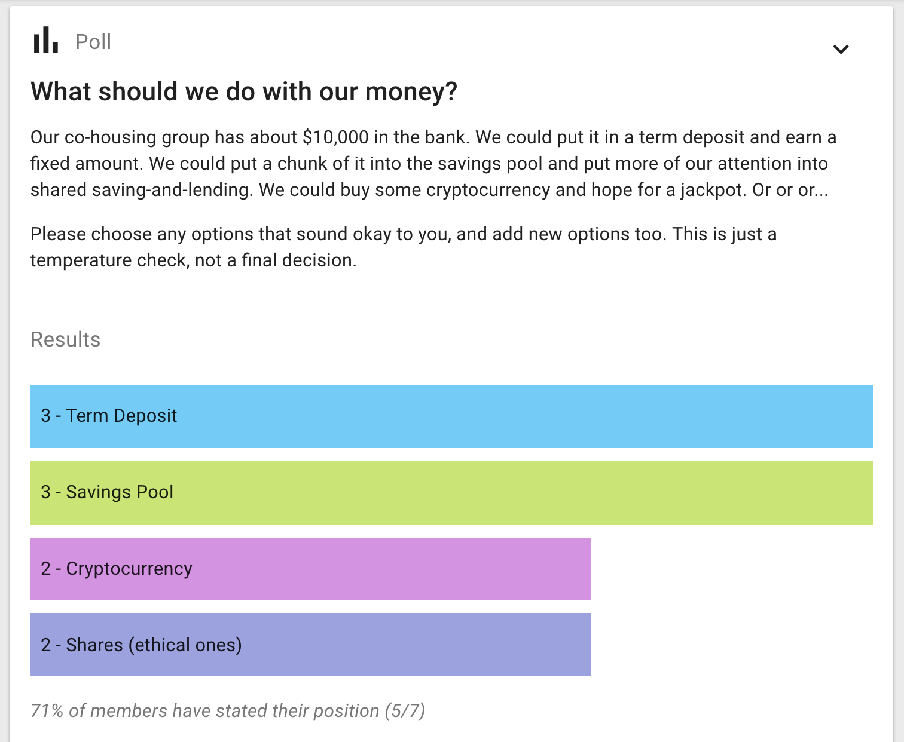
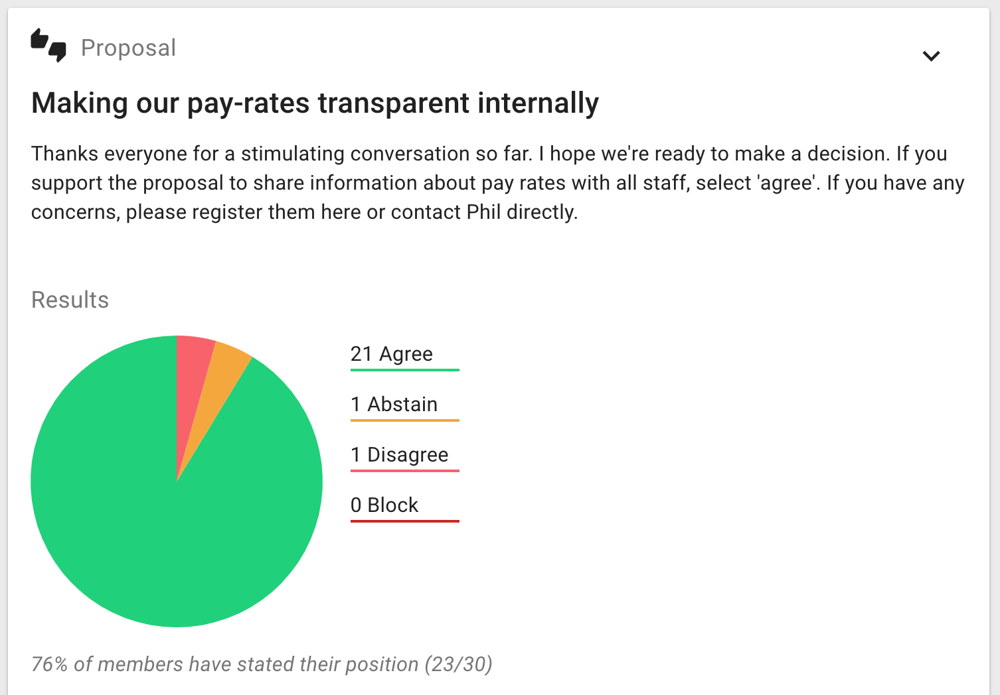

# Making decisions in Loomio

Loomio does not make decisions for you. Rather, the tool is designed to:

* communicate what decision is being made;
* make it easy to participate;
* highlight agreement and surface disagreement;
* build shared understanding;
* and keep people informed of progress.

Loomio _does not_ decide if any decision has "passed" or "failed". It's up to each group to decide how to interpret the results. For instance, [here's the decision-making protocol for the Enspiral community](https://handbook.enspiral.com/agreements/decisions.html). They have defined specific criteria for three different types of decision, e.g. how long the decision must be open for input, and what percentage of the group must participate to make a binding decision.

Loomio provides a range of tools to support your group decision-making. You can start using them right away by visiting the [New Decision page](https://www.loomio.org/p/new/).

## All Loomio decisions follow a common pattern

1. Author sets up the decision with title, details and options
2. People participate
3. People can change their minds as understanding develops
4. A reminder is sent out the day before closing
5. The poll closes, and everyone is informed of the results
6. The author sets an outcome, notifying everyone of what will happen next

## Time poll

_Find a time to meet_

Time poll makes it easy to identify when is the best time to meet.

Enter a selection of times and share the poll with the people involved. Participants tick the times they can attend and the result is a table showing who is available when, so you're able to pick the best time for the group.

So that you can arrange calls with people in other parts of the world, Loomio adjusts times so they are correct when displayed for each participant.

If the times don't work, participants can suggest alternatives using the message field. You can then update the poll with new times.

## Check

_Request or track participation_

Make an offer or ask people to take some action. Think of it as the online equilavent of asking a room of people "Please raise your hand if you…".

There are many ways you can use a check, but only two ways to respond: a Tick \(✔\), meaning affirmative, or an X mark \(✘\) meaning no or unsure.

Examples:

* I've checked my contact details are correct
* I've read the document and left my feedback
* I'm coming to the event
* I'll join the working group

A benefit of Check is that it automatically notifies those people who forget to participate, giving people a little encouragement to get the job done.

## Poll

_Measure popularity or offer a choice_

Enter a question and provide some options for people to choose from. People vote for one or more options - depending on if you allow single or multiple choice.

Write any details about the options all together in the details field, then just enter the name of the option in each poll option field.

Examples:

* Where should we have our Christmas party?
* Which catering company should we use?
* What size t-shirt would you like?
* If we ran a workshop, how likely are you to attend?

## Dot vote

_Prioritise options together_

Everyone gets a number of dots to allocate against a set of options to represent their priorities. This can build a more detailed picture than a simple poll.

Examples:

* You're given $100 to spend on the business, how would you spend it?

See [dotmocracy.org](http://dotmocracy.org/) for more tips and resources about this voting method.

## Ranked choice

_Rank options in the order of preference._

Offer a series of options for people to vote in their preferred order. You can choose the number of votes people can give and rank. This decision-making type allows people to express their opinion in more detail than traditional polls.

Ranked choice particularly useful when you have a large number of options or an election setting, where you are concerned with two somewhat similar options 'stealing' votes from one another, resulting in a less popular option gaining the plurality.

Examples:

* What would you like to eat in the company summer party?
* Who do you vote for the chairman of the board?

## Proposal

_Seek collective agreement_

Proposals are great for bringing a discussion to a clear outcome, developing or adopting policy, approving applications, and making decisions with input from others.

With good participation, a proposal creates support within the group to take action.

Participants can agree, abstain, disagree or block - and give a statement to explain their position.

### Proposals surface issues early

Don't hesitate to start a proposal just because you're not sure everyone will agree - proposals are not only for when you have consensus, they're designed to surface issues that need resolving and are useful for clarifying disagreements.

You may be surprised by getting quick consensus on something you thought was going to be complicated.

### Ways of using proposals

#### Uncover the controversy

_E.g. Let's put a bike stand next to the front desk_

If there are two or more competing ideas, propose supporting one. Controversial topics might require a series of proposals to build shared understanding.

#### Series of small Yes's

_E.g. We host the conference; dates and venue to be confirmed later_

Break down a complex issue into smaller parts and agree on them piece by piece.

#### Polarising Minority

_E.g. Share our pay rates publicly_

Sometimes loud voices can seem like they are representing more of the group than they really are. Raise a proposal to put their views in perspective.

#### Temperature Check

_E.g. Temperature Check: we should change the privacy policy_

A temperature check is a way to test how the group feels without concluding a fully realised proposal. Use it when you want to survey opinions, or test a hunch, rather than advocate for a particular position.

### Writing proposals

Include enough details so everyone knows what it means to agree or disagree.

Avoid combining a range of ideas in one proposal, because people might agree to some aspects but not others and be unsure how to respond. You can break complex decisions down into multiple proposals.

When making a proposal, state your expectations and describe the impact the proposal will have if adopted. If it's a formal or binding proposal it's often worth describing what a 'disagree' or 'block' means.

### On disagreement

'Disagree' and 'block' are often controversial positions to take. We encourage you to see them as opportunities to understand where communication has been inadequate, points of view are under-represented, or as a source of valuable insight.

If things feel tense on a personal level, we recommend that you talk one on one with the person to hear their concerns.

### Closing time

Consider how the proposal closing time will affect engagement from your group members, and choose accordingly. You might want to time the proposal so it closes before a meeting, or avoid closing over a weekend.

You can extend the deadline of an open proposal. This can be a good idea if engagement is active and people are working through the issue, or if engagement has been sparse and you'd like to prompt more participation before concluding.

### Setting an outcome

When your proposal closes, you’ll be prompted to set a proposal outcome.

In Loomio, it's not assumed that majority wins - the outcome or conclusion of a decision is up to you to define on behalf of the group. Sometimes it makes sense to go with the majority, but sometimes even one dissenting voice means it's a no.

Group members will be notified of the outcome, so it's a very useful tool for keeping people in the loop. You can clearly define next steps and name specific actions, or summarise what was learned from the process.

Examples:

_This proposal did not reach consensus because several people were concerned about budget impacts. George and Jimena will do some financial modelling and raise a new proposal next week._

or

_I've taken on board everyone's input. As the project manager, this is my call to make and I've decided we are going to extend the timeline by 10 days._

Setting outcomes makes your decision archive easy to search, because you have a succinct statement for each proposal.

